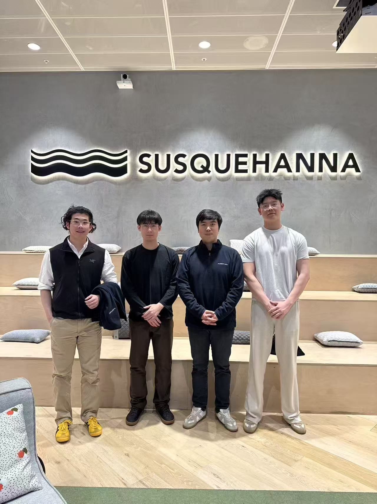
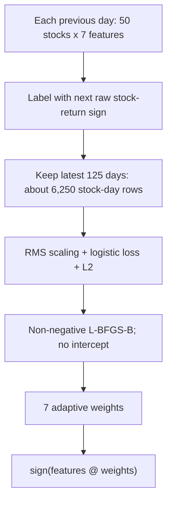
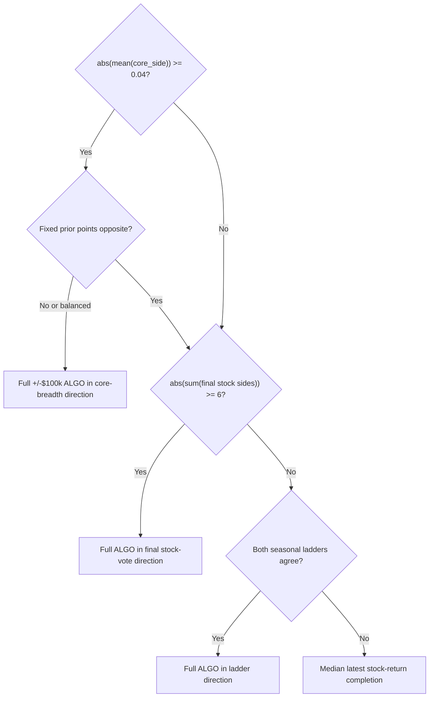

# Team abc123 - Susquehanna Algothon 2026

> **1st by technical score in the general round (395 teams)**
>
> **3rd by technical score in the final round**

We built a causal, price-only trading system for the Susquehanna x UNSW FinTech Society Algothon 2026. The final form was intended not to be an exceptional predictor. It was a constrained decision pipeline that combined several weak views of relative price movement, learned when to ignore (or reweigh) them, and deliberately discarded most of its own complexity before execution.

**Complexity in extracting information; simplicity in making decisions.**

The less comfortable lesson mattered just as much: **a strategy can be perfectly causal and still be overfit through researcher selection.** This write-up therefore covers failures, ablations, detectability, and the limits of our conclusion—not only the final code.

## Team abc123

<p align="center">
  
</p>

<p align="center">
  <strong>From left:</strong> <a href="https://github.com/andrew-yw">Andrew Wang</a> <sub>(team captain)</sub> · <a href="https://github.com/EscapedShark">Peidong (Isaac) Liu</a> · <a href="https://github.com/Yiping-Yin">Yiping Yin</a> · <a href="https://github.com/jacksonzhong655-gif">Lingjie (Jackson) Zhong</a>
</p>

## Contents

- [Team abc123](#team-abc123)
- [Why publish this](#why-publish-this)
- [Post-competition research report](#post-competition-research-report)
- [The challenge](#the-challenge)
- [Architecture](#architecture)
- [Research philosophy](#research-philosophy)
- [Changing the prediction target](#changing-the-prediction-target)
- [Building the core](#building-the-core)
- [Pairs: useful, but not how we expected](#pairs-useful-but-not-how-we-expected)
- [Complementary evidence](#complementary-evidence)
- [The breakthrough was not another signal](#the-breakthrough-was-not-another-signal)
- [Why sign-only, full-limit execution](#why-sign-only-full-limit-execution)
- [Instrument 0: factor in research, capacity in execution](#instrument-0-factor-in-research-capacity-in-execution)
- [Research graveyard](#research-graveyard)
- [Causal does not mean out-of-sample](#causal-does-not-mean-out-of-sample)
- [Why Simple2—and why we stopped searching](#why-simple2and-why-we-stopped-searching)
- [Results, attribution, and limitations](#results-attribution-and-limitations)
- [What we would do differently](#what-we-would-do-differently)
- [FAQ](#faq)
- [Code and acknowledgements](#code-and-acknowledgements)

## Why publish this

Competition write-ups can make research look cleaner than it was: choose a signal, tune it, win. Our path was less linear and more useful.

We found promising relationships that failed when given their own capital. We found causal improvements that did not survive frozen tests. We improved Sharpe while reducing the actual score. Eventually, the most valuable redesign was not adding information but changing how existing information was allowed to affect a trade.

That progression—hypothesis, test, failure, redesign, validation—is the real subject of this repository.

## Post-competition research report

Yiping Yin's 69-page report, [*Forecasting Under a Limited Effective Sample*](research/forecasting_under_a_limited_effective_sample.pdf), extends the team record beyond this implementation write-up. It reconstructs the rules and evaluator, formalises the staged-data validation protocol, grades evidence by source, and revisits model selection, falsification, and the verified final-round technical result.

The report provides a fuller account of the research depth and evidence than the time-limited final presentation could accommodate. It is deliberately careful about what the public replay can—and cannot—establish.

## The challenge

Each call to `getMyPosition(prcSoFar)` received only the visible price prefix. The universe contained 51 instruments: instrument 0, called ALGO here, and 50 stocks. Positions were integer shares, clipped to dollar limits of $100,000 for ALGO and $10,000 for every stock. Stock turnover cost 1 bp; ALGO turnover cost 0.2 bp.

The public evaluator scored the final 250 days. If daily P&L has positive mean \(\mu\), standard deviation \(\sigma\), and annualised Sharpe \(SR=\sqrt{250}\mu/\sigma\), then

\[
\text{score}=\mu\frac{SR^2}{SR^2+1}.
\]

This objective rewards mean P&L, moderated by a Sharpe multiplier. It does not reward calibrated probabilities or elegant forecasts by themselves; a forecast matters only through the positions, costs, and limits that the evaluator actually applies. Our local harness mirrored those semantics, including causal prefixes, integer clipping, commissions, and the evaluator's timing.

See the official public [Algothon 2026 starter evaluator](https://github.com/UNSW-FinTech-Society-IT/algothon26-starter-code/blob/main/eval.py) for the mechanics. We do not publish competition price data or private organiser material here.

## Architecture


Every arrow is causal: at decision time \(T\), the strategy uses information observable by \(T\). The pipeline progressively compresses 51 price histories into residual structure, a \(50\times7\) feature matrix, one score per stock, and finally a sign.

The final implementation is in [`strategy/abc123.py`](strategy/abc123.py).

## Research philosophy

Three ideas shaped the final system.

1. **Predict relative movement first.** Broad market movement is easier to mistake for stock-specific skill. Much of the stock engine therefore predicts residual returns after removing a common factor.
2. **Prefer complementary weak evidence to one heroic backtest.** Sparse propagation, low-rank propagation, pair pressure, and reversal make different structural assumptions. Their errors matter as much as their standalone accuracy.
3. **Constrain the last mile.** The strategy can adapt feature weights, but it cannot invert a feature, fit an intercept, or turn confidence into elaborate sizing. Flexibility is concentrated in feature construction; the final decision is deliberately low-capacity.

Chronological causality was necessary throughout, but it was not sufficient. Reusing the same legal history for enough choices can overfit the researcher even when the code never reads the future.

## Changing the prediction target

For stock \(i\), we write

\[
r_{i,t}=\beta_{i,t}r_{M,t}+\varepsilon_{i,t},
\]

where instrument 0 is the common-market proxy. Much of the stock model targets the residual component \(\varepsilon\), asking which stocks will relatively outperform rather than whether the whole market will rise.

### A drift-adaptive beta

For each stock, the code:

1. estimates a long-run OLS beta;
2. estimates beta and its standard error in adjacent recent and prior 250-day windows;
3. gives the recent estimate influence only when its change is large relative to the two estimates' sampling uncertainty;
4. moves from the long-run estimate toward the recent estimate by that gated weight; and
5. clips the result to \([0.25,2.50]\).

With fewer than 500 market returns, it uses the clipped long-run beta directly. After subtracting \(\beta_i r_M\), it demeans residuals across stocks each day to remove any remaining common residual level.

We interpret this design as **stable by default, adaptive when justified**. That is an architectural interpretation, not a claim about the team's originally documented intent.

Residualisation does not make the final portfolio beta-neutral, and it does not forbid today's market return from predicting tomorrow's relative stock moves. It changes the stock-model target; ALGO later receives a separate execution decision.

## Building the core

The core combines one-day information propagation with medium-horizon mean reversion.

### Sparse lead-lag

At time \(t\), the predictors are the current ALGO return plus the 50 current stock residuals. The targets are the next-day residuals of all 50 stocks. Predictors and targets are standardised.

The important structure is a **lag-1, 50-by-50 leader/follower coefficient matrix**—not a bundle of several lags for each leader. The matrix is decomposed into row- and column-group components:

- active row groups correspond roughly to stocks that are broadly useful leaders;
- active column groups correspond roughly to stocks that are broadly predictable followers; and
- the retained support is the union of active leader rows and active follower columns.

The market predictor is always retained. The selected relationships are then refitted with Ridge, separating structural selection from coefficient estimation.

> **Group Lasso decides which structural relationships deserve to exist; Ridge decides their final stable coefficients.**

The sparse post-selection forecast drives the core. A parallel dense Ridge forecast is not traded independently; it supplies conviction gating for the later pair counterfactual.

### Residual reversal

The second core component averages reversal over 15, 20, and 25 days:

\[
\operatorname{rev}_i(h)=
-\frac{\sum_{k=1}^{h}\varepsilon_{i,t-k}}
{\operatorname{vol}(\varepsilon_i)\sqrt{h}}.
\]

Averaging nearby horizons avoids choosing one lucky lookback. Volatility normalisation asks whether a move was unusual for that stock rather than merely large in percentage terms. The combined reversal vector is projected away from the leading two residual principal components, estimated over at most 250 days.

The core score is

\[
\operatorname{csz}\left(
\text{sparse lead-lag}
+0.20\,\operatorname{csz}(\text{residual reversal})
\right),
\]

and the core book takes its sign.

Why remove latent PCs from reversal but not lead-lag? The code makes that asymmetry explicit; our interpretation is that a mechanical reversal rule can accidentally become a cluster bet, while a latent cross-sectional mode may itself carry useful propagation information in lead-lag. Blanket neutralisation there could erase the structure being modelled. Broader tests also found that more aggressive factor neutralisation reduced score, but this explanation of the design is architectural inference rather than documented historical intent.

## Pairs: useful, but not how we expected

> **Pairs looked like a strategy. Testing taught us they were more useful as a warning.**

Our early intuition was conventional: identify stable spreads and give the pair sleeve capital. In the unified development lineage, a hard replacement-style sleeve moved score from roughly **821 to 721**. Pair information was not worthless; we had given it the wrong authority.

The final pair engine is intentionally conservative:

- stock-stock pairs only;
- a 1:1 log-price spread with an intercept, rather than a fitted trading hedge ratio;
- filters for sensible positive AR(1) persistence below 0.98, return correlation above 0.15, at least eight mean crossings, and a finite ADF(1) statistic;
- greedy disjoint selection, up to 12 pairs, so overlapping algebraic combinations do not masquerade as independent evidence;
- four formation views: full history, 500, 360, and 420 days, refreshed slowly;
- a long-versus-short beta-structure health check, rejecting drift above 0.40;
- agreement among 100-, 120-, and 150-day spread z-scores;
- entry at \(|\operatorname{median}z|\ge0.40\), exit inside 0.35 or on sign disagreement;
- when several books support the same direction, the minimum supporting confidence is used;
- protection for the two strongest core-conviction names;
- after sufficient history, pair confidence must beat half the dense-core conviction; and
- a bounded number of counterfactual flips.


The counterfactual book is **not** directly traded. Instead,

\[
\texttt{overlay\_innovation}
=\tfrac12\left(
\operatorname{sign}(\text{pair-modified book})-\texttt{core\_side}
\right).
\]

Agreement becomes 0; a validated long-to-short flip becomes -1; a short-to-long flip becomes +1. Its prior blender weight is exactly zero. Pair dissent must earn influence from recent labelled outcomes.

## Complementary evidence

The final seven columns are not seven independent economic alphas. They are a few ideas expressed under different structural assumptions and with two limited nonlinear basis expansions.

### Low-rank propagation

Lowrank studies a similar one-day forecasting problem to sparse lead-lag but makes the opposite structural bet. It uses standardised raw stock returns plus ALGO as predictors and next-day residuals as targets. A dense Ridge coefficient matrix is decomposed by SVD; rank-3, 4, 5, and 6 forecasts are cross-sectionally standardised and averaged.

Sparse lead-lag asks whether a small leader/follower network matters. Lowrank asks whether many apparent links are generated by a few latent propagation modes.

### Pairnet

Pairnet is separate from the stateful pair overlay. It is a continuous cross-sectional feature. Every stock-pair spread receives an ADF(1) statistic; pairs with \(t<-3.2\) are eligible. Up to 20 disjoint pairs are selected greedily and refreshed every 50 days. A 250-day spread z-score pushes the two legs in opposite mean-reversion directions, weighted by \(|t_{ADF}|\).

The pair overlay asks whether a carefully validated disagreement should challenge a core trade. Pairnet continuously aggregates relative-value pressure across a sparse pair network.

### Slow level reversion and nonlinear bases

The level feature averages volatility- and \(\sqrt{h}\)-normalised residual reversal over 250, 350, 500, and 650 days. Two extra columns let the linear blender express limited nonlinearity:

- `level_tail` equals `level` only when \(|\texttt{level}|\ge2\), otherwise zero;
- `pairnet_rank` equals `pairnet` multiplied by the cross-sectional rank of its absolute magnitude, divided by the number of stocks.

The complete feature order is fixed in code:

| Feature | Role | Coverage | Standalone directional hit | Score change when removed |
|---|---|---:|---:|---:|
| `core_side` | Sparse propagation + residual reversal backbone | 100% | 52.14% | -128 |
| `overlay_innovation` | Conservative pair/core dissent | 17.1% | 51.73% | -57 |
| `lowrank` | Low-dimensional lag-1 propagation | 100% | **52.56%** | **-255** |
| `pairnet` | Continuous disjoint-pair reversion pressure | 87.5% | 51.79% | -29 |
| `level` | Slow residual level reversion | 100% | 50.16% | -18 |
| `level_tail` | Extreme-level basis | 4.4% | 51.42% | -6 |
| `pairnet_rank` | Ranked-magnitude pairnet basis | 87.5% | 51.79% | -73 |

No standalone feature exceeded 52.6%, but the combined engine measured **53.63%**. Even `level`, which was only 50.16% alone, had positive marginal value in the ablation. Standalone hit rate is not the same thing as marginal portfolio value.

## The breakthrough was not another signal

> **The breakthrough was stopping every signal from trading on its own.**

Earlier versions let components behave more like position-setting sleeves. The key redesign demoted them to evidence columns and introduced a rolling, non-negative logistic blender. In the unified development harness, the internal audit attributes roughly **773 to 1117.38**, about **+344 score**, to this architecture change. This is a development-lineage result, not an official competition score and not the same comparison as the smaller later Simple2-versus-Final2 switches.



Each previous feature row is labelled when the next raw stock return prints—**not** with residual-return sign. A 125-day window supplies approximately \(125\times50=6{,}250\) stock-day rows, but these are not 6,250 independent observations: stocks on the same day are cross-sectionally dependent.

After RMS column scaling, the fitted problem is

\[
\min_{w\ge0}
\frac1n\sum_j\log\!\left(1+e^{-y_jx_j^\top w}\right)
+\frac{0.001}{2}\lVert w\rVert_2^2.
\]

The code refits daily with L-BFGS-B, warm-starts from the previous solution, and fits no intercept. Before 125 labelled days exist, it uses priors

```text
[1, 0, 1, 1, 0.25, 0.25, 0.25]
```

in the exact feature order shown above.

Non-negativity was the key restraint. Each column was constructed with an intended direction. A short rolling sample may downweight or disable it, but cannot reinterpret reversal as momentum merely because that fit the recent past.

> **Trust it, downweight it, or switch it off—never invert it.**

## Why sign-only, full-limit execution

The stock decision is

```text
side = sign(features @ weights)
```

An exact zero falls back to `core_side`, and each stock takes its full positive or negative $10,000 dollar limit.

This aggressive-looking rule followed from the competition objective and the observed regime. Realised annualised Sharpe was already about 8.5, making the Sharpe multiplier roughly 0.986. Even infinite Sharpe would have added only about 1.35% through that multiplier—around 15 score points in the audit, below the estimated detectability threshold. Meanwhile, the stock book was essentially always at its dollar limits.

Confidence trimming also failed directly: dropping the weakest 10%, 20%, and 30% of positions reduced score by roughly 48, 81, and 141 points. The most stable information appeared to be directional rather than a calibrated measure of magnitude.

This is a conclusion about **this competition objective and this strategy regime**. It is not an argument against risk management, portfolio construction, or partial sizing in real trading.

## Instrument 0: factor in research, capacity in execution

> **Factor in research, capacity in execution.**

ALGO serves two separate purposes. During stock signal construction, it is the common-factor proxy. After the stock book is formed, it is a high-capacity execution leg. It is not a beta hedge.



The primary branch uses core breadth. With 50 mostly \(\pm1\) sides, the 0.04 gate is essentially a minimum 26/24 imbalance. A fixed structural prior combining core, lowrank, pairnet, and level can veto only when its breadth points the other way; a balanced prior does not veto. When allowed, ALGO takes the full $100,000 limit in the core-breadth direction.

If that branch is silent, the cascade tries the final blended stock vote, requiring \(|\sum_i\texttt{side}_i|\ge6\). It then tries two seasonal ladders, `(22, 44, 88)` and `(23, 46, 92)`, only when both agree. If everything remains silent, it uses the sign of the latest median stock return.

| ALGO branch | Days | Directional hit rate |
|---|---:|---:|
| Core breadth + prior veto | 867 | 54.09% |
| Final stock net vote | 91 | 59.34% |
| Seasonal ladders | 139 | 50.36% |
| Median completion | 153 | 58.82% |
| **Whole cascade** | **1,250** | **54.64%** |

No individual branch cleared its own significance threshold; only the aggregate cascade did. The seasonal fallback should not be romanticised as a discovered 22-day cycle: periodicity diagnostics did not support that claim, and its standalone hit rate was near 50%.

## Research graveyard

Rejected ideas were not side notes. They changed the architecture.

| Idea | Why it looked plausible | What challenged it | Decision |
|---|---|---|---|
| Hard pair replacement sleeve | Cointegrated spreads appeared directly tradable | Unified-lineage score fell roughly 821 -> 721 | **Downgrade:** retain pair disagreement as a zero-prior feature |
| Confidence trimming / partial stock exposure | Avoid weak forecasts and improve risk-adjusted returns | Trimming 10% / 20% / 30% reduced score by about 48 / 81 / 141 | **Reject** for this objective |
| More aggressive factor neutralisation | Cleaner relative exposures and higher Sharpe | A more risk-neutral variant raised Sharpe from 8.555 to 8.721 but lost score | **Reject** as a score improvement |
| Later mechanism tweaks | Plausible refinements around an already strong engine | Several sat on a narrow 767-780 plateau and failed frozen promotion criteria | **Reject** rather than optimise the holdout |
| Treating seasonal ALGO lags as a cycle | The lags looked narratively coherent | Periodicity diagnostics did not support the story; branch hit rate was near chance | **Keep only** as a frozen cascade fallback, without a cycle claim |
| Independent position-setting sleeves | Let each model express its own conviction | Combination architecture dominated; sleeve interaction was the main problem | **Replace** with feature-level blending |

The point is not that every rejected idea was foolish. Most were plausible enough to test. The point is that plausibility did not earn promotion.

## Causal does not mean out-of-sample

A signal can use only information available at time \(T\) and still be overfit. If we try enough lags, windows, feature transforms, and model families, then repeatedly inspect the same legal history, our selection process learns that history even though the strategy code never sees the future.

We therefore treated the research process itself as part of the statistical problem:

- frozen chronological blocks and walk-forward evaluation;
- no feature or parameter selection on the final chronological holdout;
- one-change ablations and negative controls;
- exact reproduction of evaluator timing, commissions, integer positions, and limits;
- frozen or pre-registered promotion thresholds for mechanism tests;
- multiple-testing and max-of-\(K\) null calibration;
- sign consistency across five 250-day blocks, rather than reliance on a pooled mean; and
- explicit labelling of windows contaminated by repeated development use.

### First ask whether an effect is measurable

The audit calibrated about **+187 score points per +1 percentage point** of stock directional hit rate. Estimated minimum detectable improvement was about **+31.5 score**, equivalent to **+0.168 percentage points** of hit rate, while block-to-block noise was around \(\pm0.27\) percentage points.

This produces a practical question before backtesting a niche mechanism: does it touch enough decisions to matter? The project-specific rule of thumb was

\[
N(2q-1)\ge110,
\]

where \(N\) is the number of affected stock-day decisions and \(q\) is their directional accuracy. A rare signal may be locally impressive yet structurally incapable of producing a measurable total improvement.

### The search has a noise budget

Across roughly **600 scored hypotheses** from several method families, the best legal incremental result was only about **+7.44**. A null search of comparable scale could itself produce around **+70** through selection.

A positive causal backtest was therefore not enough. Its gain had to exceed both ordinary sampling noise and the selection opportunity created by the size of the search.

## Why Simple2—and why we stopped searching

We did not prove that no better strategy exists. We found three independent reasons to freeze the baseline rather than keep mining small improvements.

### 1. Objective structure

With position limits saturated and the Sharpe multiplier already near one, most measurable remaining value had to come from better directional decisions. Risk-only refinements had little score headroom and could lose mean P&L.

### 2. Search evidence

Hundreds of legal candidates across different method families produced no reliable right tail after pricing in search scale. The best incremental result was below the estimated detectability threshold and far below the max-of-\(K\) null selection ceiling.

### 3. Information audit

A compression-based audit estimated only about **0.10-0.17 bits/day** of predictable temporal structure, versus roughly **8.8-9.3 bits/day** of same-day risk structure. Its empirical directional ceiling was around **52.6-53.4%**, while the combined engine measured **53.63%**.

A separate future-aware, deliberately invalid upper-bound model used richer information. After removing same-day peer leakage, it reached about **52.95%**, below the engine. This is evidence that remaining price-only improvement was hard to detect reliably—not a mathematical upper bound on all possible strategies.

Our conclusion is deliberately narrow:

> **Within the information and search space available to us, we found no statistically detectable improvement large enough to justify replacing the frozen baseline.**

## Results, attribution, and limitations

### Competition result

- **1st by technical score in the general round, from 395 teams**
- **3rd by technical score in the final round**

### What the research evidence supports

- Best standalone feature: `lowrank`, about **52.56%** directional hit rate.
- Combined seven-feature engine: **53.63%**.
- Every feature had positive marginal value in the recorded one-feature ablation, despite weak standalone results.
- Whole ALGO cascade: **54.64%** over 1,250 attributed decisions, although no individual branch cleared its own threshold.
- The large late architecture gain was the shift from independent sleeves to the online non-negative feature blender, about **+344** in the unified harness.

### What it does not support

The later choice between Simple2 and Final2 was regime-dependent. Simple2's advantage in the most recent 500-day comparison was likely contaminated by repeated development use and must not be treated as clean out-of-sample evidence. In earlier blocks, Final2 led on average, but no block established a statistically significant advantage either.

The aggregate Simple2-versus-Final2 difference was also concentrated: about **87.3%** was attributed to instrument 0, and a relatively small number of strong ALGO days drove much of the most recent-regime gain.

These are uncomfortable results, but they sharpen the distinction between an interesting result and broad, robust evidence. They are why we present Simple2 as the frozen choice under an evidence threshold, not as a universally dominant model.

## What we would do differently

In hindsight, we would formalise the research protocol earlier:

- reserve immutable chronological holdouts before the first architecture search, not merely before final tuning;
- log every candidate, family, affected-decision count, and promotion rule in one experiment registry;
- estimate detectability before implementing narrow mechanisms;
- test features as information sources before granting them position-setting authority; and
- separate architecture selection from the later, smaller choice among frozen variants.

The broad lesson is that better research infrastructure would have reduced both wasted search and ambiguity around the final regime comparison.

## FAQ

### Why residualise against ALGO and then trade ALGO later?

The two decisions answer different questions. Residualisation stops stock models from mistaking a broad market move for stock-specific alpha. The later ALGO leg expresses a separate market-direction view inferred from stock breadth. **Factor in research, capacity in execution.**

### Why Group Lasso followed by Ridge?

The structured Group Lasso selects leader rows and follower columns in the lag-1 stock residual matrix. Ridge then refits the retained relationships more stably. Selection and coefficient estimation are different jobs.

### Does Group Lasso group several lags of one leader?

No. The final code uses one lag. Its groups are rows and columns of the 50-by-50 leader/follower matrix.

### Why remove latent PCs from reversal but not lead-lag?

The code does this explicitly. We interpret it as removing unintended cluster exposure from mechanical reversal while preserving latent propagation modes that may be predictive in lead-lag. That rationale is an architectural interpretation, not documented historical intent.

### How is pair overlay different from pairnet?

The overlay is a stateful, highly gated counterfactual that records disagreement with the core. Pairnet is a continuous cross-sectional pressure feature built from up to 20 disjoint ADF-ranked pairs.

### Why did pairs become a dissent feature?

A hard pair replacement sleeve lost about 100 score points in the unified lineage. The final design therefore asks pairs to challenge selected core trades and gives that disagreement zero prior weight.

### Why non-negative logistic weights?

Each feature has an intended economic direction. The blender may trust, downweight, or disable it, but cannot turn a short run of poor reversal into an automatically fitted momentum strategy.

### Is a 125-day fit only 125 observations?

It contains roughly 6,250 stock-day rows—125 days times 50 stocks—but those rows are not independent because stocks on the same date share cross-sectional structure.

### Why full-limit, sign-only stock positions?

The realised Sharpe multiplier was already near saturation, positions were effectively at their caps, and confidence trimming reduced score. Under this specific objective, direction carried more reproducible value than confidence magnitude.

### Is 53.63% meaningful?

In a high-turnover, symmetric directional setting, a small edge repeated across many stock-days can matter. Its importance here comes from the evaluator-calibrated score sensitivity and ablations, not from the percentage in isolation.

### How did we control overfitting after so many trials?

We used frozen chronological blocks, walk-forward tests, one-change ablations, negative controls, exact evaluator reproduction, promotion thresholds, and max-of-\(K\) null calibration. We also label the recent 500-day comparison as contaminated rather than presenting it as clean holdout evidence.

### Why stop searching?

The remaining gains were below detectability, the search scale could generate larger false winners under a null, and an independent information audit suggested the engine was already near the empirical price-only ceiling. That justified freezing—not claiming optimality.

## Code and acknowledgements

The final implementation is [`strategy/abc123.py`](strategy/abc123.py). The most relevant sections are:

- adaptive beta and residual construction: `_ols_beta_and_se`, `_signal_beta`, `_residuals`;
- core: `_residual_reversal`, `_lead_lag_signals`, `_group_lasso_support`, `_post_selection_ridge`;
- pairs: `_select_pairs`, `_PairBook.target_sign`, `_apply_pair_overlay`, `_pairnet_signal`;
- complementary features and blender: `_blend_features`, `_rebuild_blend_history`, `_label_pending`, `_fit_weights`; and
- ALGO cascade: `_breadth_direction`, `_algo_tilt_position`, `_idle_algo_position`, and `_Strategy.step`.

The runtime dependencies are NumPy and SciPy; they are listed in [`requirements.txt`](requirements.txt).

The post-competition report, [*Forecasting Under a Limited Effective Sample*](research/forecasting_under_a_limited_effective_sample.pdf), was written by [Yiping Yin](https://github.com/Yiping-Yin). We thank her for extending the team's work into a rigorous, evidence-graded research record.

Thanks to Susquehanna and the UNSW FinTech Society for organising Algothon 2026.

This is a team research retrospective. Throughout, “we” refers to **Team abc123**.
